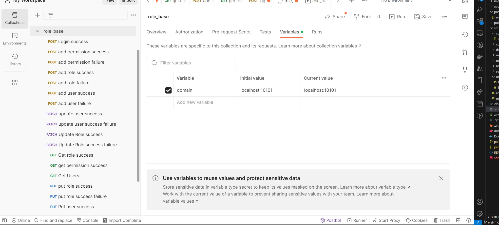
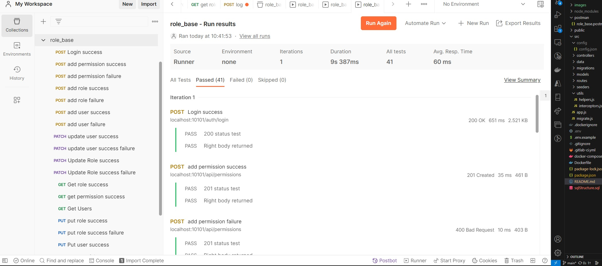

## Node.js/TypeScript/MongoDB Base Backend

This is a base project which helps any node.js developer or startup to setup a base for user/role/permission management, testing, dockerization, and CI/CD.
This is built with Express.js framework, TypeScript, MongoDB database, and tested with Jest and Postman.
This is usually a first and difficult step for any startup and this project will get you up and running immediately.

### Technologies and Resources

- Node.js
- Express.js
- TypeScript
- MongoDB
- Postman
- Jest
- Docker/Docker Compose
- Git

### Setup

1. Download and Install your variant of MongoDB from [here](https://www.mongodb.com/try/download/community).
2. Open the app and create a database called _nodebase_.

3. Install Node.js. Download your variant from [here](https://nodejs.org/en/download/)

- After install, open git bash or a terminal and type the command below to see if you get the help page

```
npm -h
```

4. Clone this repository

```
git clone https://github.com/scneba/node_typescript_base.git
```

5. open git bash on the root folder and run

```
npm install
```

6. Make a copy of the .env.example and rename it to .env
7. Update the connection string on line 2 to include your mongodb connection string

```
MONGO_URL="mongodb://localhost:27017/nodebase"
```

8. Run `npm run dev` on the root folder to start the project.

9. Install postman and create an account. Download from [here](https://www.postman.com/downloads/).

## Development

### File structure

**--postman**: Postman collection \
**&nbsp;&nbsp;&nbsp;--nodebase.postman_collection.json** postman collection to import and run on postman. \
**--src** All source code should be added in here. \
\***\*&nbsp;&nbsp; --controllers** MVC controllers - all core logic for endpoint control is added here.
Each folder name ends in "ing" and represents related subcontroller logic. Each subcontroller has the following files \
&nbsp;&nbsp;&nbsp;**--errors.ts** All subcontroller erros.\
&nbsp;&nbsp;&nbsp;**--service.ts** All the logic for the subcontroller should be added here. \
&nbsp;&nbsp;&nbsp;**--service.test.ts** All tests for this subcontroller should be added here. See the documentation for jest testing [here](https://jestjs.io/docs/getting-started). \
**--data** all database access methods are added here. \
**--models** All database models for MongoDB
**--routes** All routes contained in the repo.
**--seeder** All MongoDB Seeds are added here. \
**--utils** Any reusable typescript code \
**--index.ts** entry point of application. \
**--connectmong.ts** service to connect to mongodb\

### Run Seeds

- Update the connection string on line 19, src/seeder/seeder.ts to your mongodb connection string.
- Run this command in the root folder to run the seeds on the database

```
npx tsnd src\seeder\seeder.ts
```

### Testing

Ideally, all core logic in controllers should be tested. To test particular sub controller/file, use the testPathPattern eg.

```
npm test -- --testPathPattern "registering/"
```

This will run all tests in the registering/ path.

### Postman

Import the collection at Postman/nodebase.postman_collection.json into postman.
Update the domain variable in postman


- Start project with ts-node

```
npm run dev
```

- Run postman collection and make sure all tests pass
  

Congratulations, you are ready to start development with this base project.
